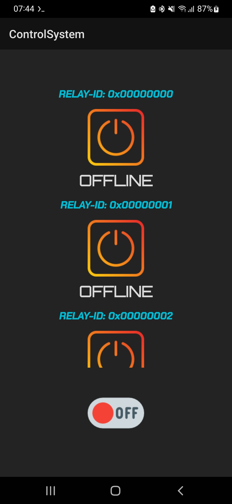
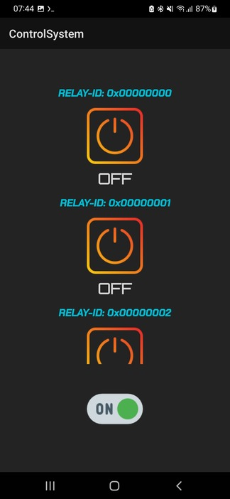
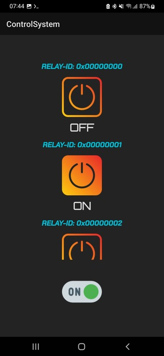
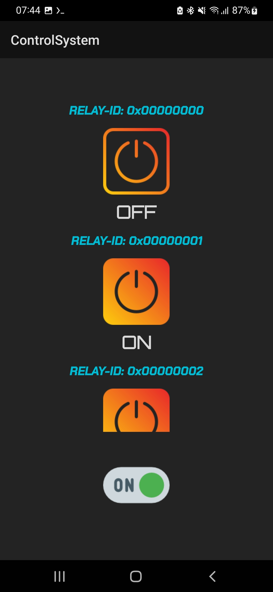

Certainly! Here's a README based on the provided structure and code snippets:

---

# Remote Appliance Control System 📲🔌

This project utilizes ESP8266, Arduino Nano, and a 4-channel Relay to remotely control appliances. The system operates through a custom app, enabling users to control appliances using the relay switches.

## Screenshots 📸
|  |  |
|---------------------------------------|---------------------------------------|
|  |  |


## Project Structure 📁
```
- ControlProcessor/
  - ControlProcessor.ino
  - i2c_slave.h
  - relay.h
- NetworkBridge/
  - i2c_master.h
  - NetworkBridge.ino
  - server.h
```

### ControlProcessor Module Structure 🕹️
- **`ControlProcessor.ino`**: Controls the relays based on received commands.
- **`i2c_slave.h`**: Handles I2C communication with the master.
- **`relay.h`**: Manages relay pins and their states.

### ControlProcessor Module Code
```cpp
// ControlProcessor.ino
#include "i2c_slave.h"
#include "relay.h"

void setup(){
  init_i2c_bus();
  init_control_relays();
}

void loop(){
  drive_relays(command);
  delay(100);
}
// ... (other functions defined in i2c_slave.h and relay.h)
```

### NetworkBridge Module Structure 🌐
- **`i2c_master.h`**: Manages I2C communication as the master device.
- **`NetworkBridge.ino`**: Sets up the network and manages the relay control server.
- **`server.h`**: Handles HTTP server and relay control functionalities.

### NetworkBridge Module Code
```cpp
// NetworkBridge.ino
#include <Wire.h>
#define TARGET_ADDR 0xBE

void setup(){
  init_net();
  init_server();
  init_i2c_bus();
  reset_relays();
}

void loop(){
  server_loop();
  delay(100);
}
// ... (other functions defined in i2c_master.h and server.h)
```

---

This project combines two modules: the ControlProcessor manages the relay states based on I2C commands, while the NetworkBridge serves as the master device controlling the relays and managing the server for remote control through a custom app. 📲🌐
